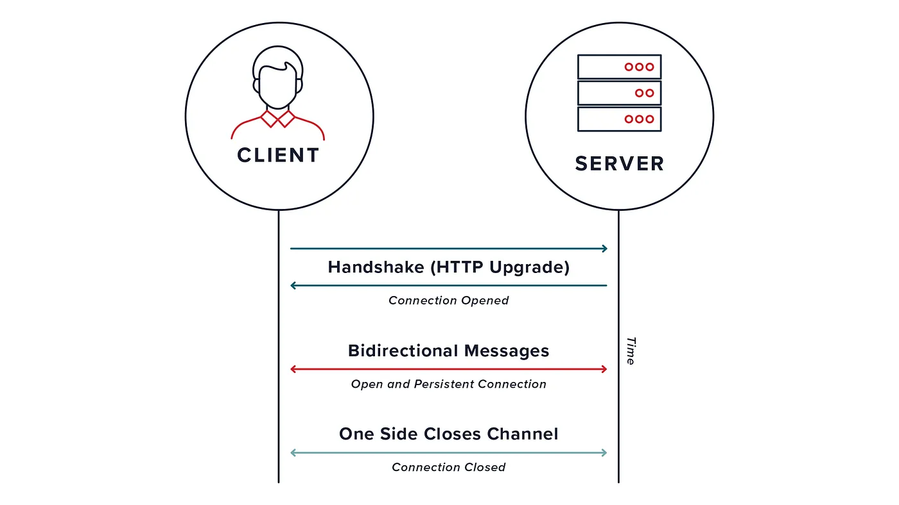

# Queue App with WebSocket and REST API
This project is a queue application developed with Node.js, using Express for the REST API and Socket.io for real-time communication via WebSocket.

Technologies Used
Node.js: A runtime environment for executing JavaScript on the server.
Express: A framework for building web applications and APIs in Node.js.
Socket.io: A library for enabling real-time, bidirectional communication between web clients and servers.

